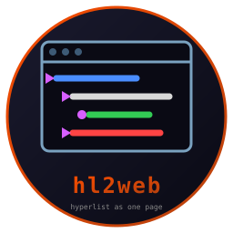
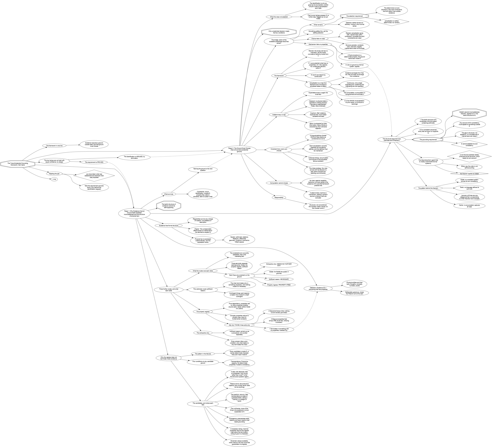

# hl2web

   [](https://github.com/isene/fe2o3)

Render a [HyperList](https://isene.org/hyperlist/) as one self-contained
interactive HTML page. No frameworks, no external assets, nothing to
host but the file itself.



A HyperList can describe anything: plans, arguments, processes, systems.
Sharing one used to mean a PDF or a screenshot. hl2web gives the web the
real thing: folding, search, and the colors you know from hyperlist.vim.

<br clear="left"/>

## The prime example: TEG

`examples/TEG.hl` maps the Trans-Existential Grounding framework, the
argument of two papers ([isene.com/freewill](https://isene.com/freewill/)):
existence cannot ground itself, and the ground must choose. Rendered, it
becomes an explorable argument: fold a route, follow a cross-reference
from one paper's claim to the other's theorem, search for an objection.

```sh
hl2web --title "TEG" --graph examples/TEG.hl > TEG.html
```

See it live: [isene.com/freewill/TEG.html](https://isene.com/freewill/TEG.html)

With `--graph` the page ends in a
[hypergraph](https://github.com/isene/hypergraph) rendering of the list:



## Usage

```sh
hl2web file.hl > file.html
hl2web --title "My List" file.hl > file.html
hl2web --graph file.hl > file.html
```

Indentation is read from the file: tabs, or whatever space step it uses
(2, 3 or 4). Open the HTML anywhere, phone included. Folding works even with
JavaScript disabled (native details/summary).

`--graph` renders the list with
[hypergraph](https://github.com/isene/hypergraph) and embeds the PNG at
the bottom of the page as a data URI, so the file stays self-contained.
Skipped with a warning when hypergraph is not installed.

It takes an optional quoted string of hypergraph flags (direction, edge
type, theme, separation); the default is `-s -l`. Format and output file
stay fixed, since the embed needs a PNG:

```sh
hl2web --graph "-t -d -T tech" file.hl > file.html
```

## What the page gives you

- Native folding: click any parent, or the 1/2/3/4/all/none buttons;
  the page opens collapsed to the top level
- Live search: matching items highlight, ancestors unfold, rest hides
- hyperlist.vim colors: Operators blue, Properties red, Qualifiers
  green, Starters and references magenta, comments and quotes teal,
  hashtags yellow, FIXME/TODO black on yellow
- Checkboxes as symbols, `*bold* /italic/ _underline_` markup,
  literal blocks (`\`) rendered verbatim

## Install

```sh
git clone https://github.com/isene/hl2web
cd hl2web
cargo build --release
ln -s "$PWD/target/release/hl2web" ~/bin/hl2web
```

## License

Public domain (Unlicense). Do what you want with it.
